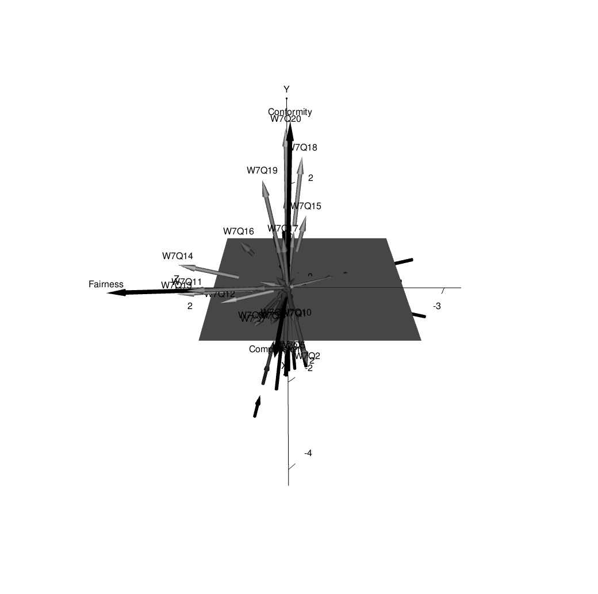
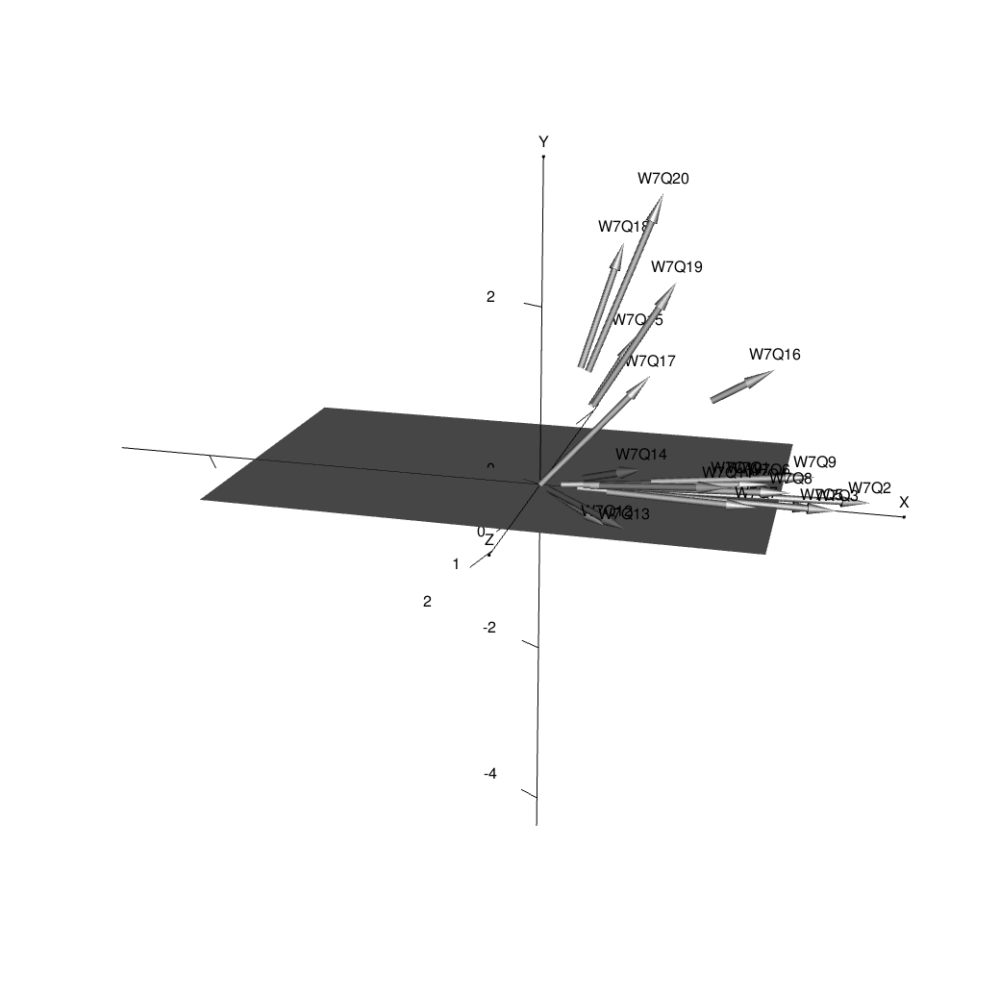
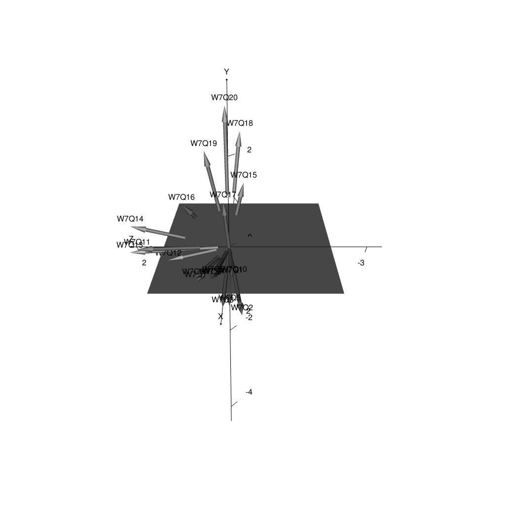
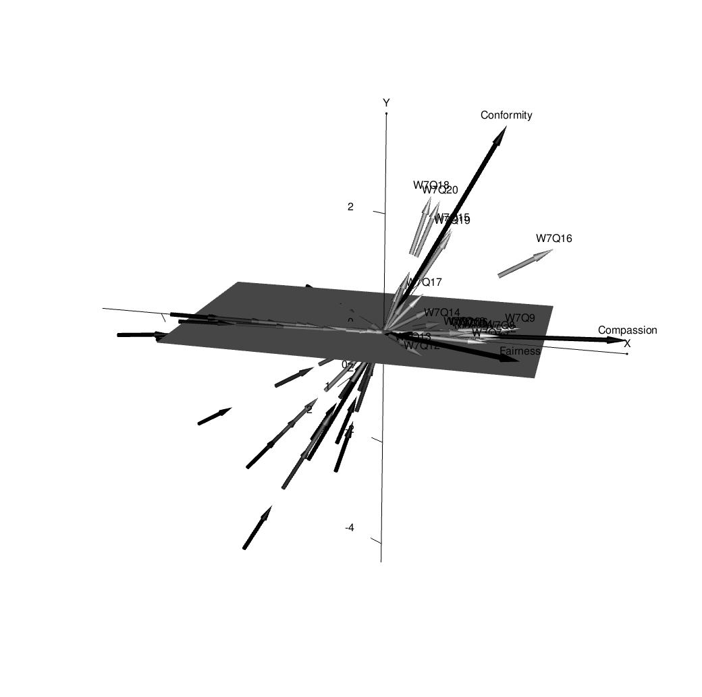
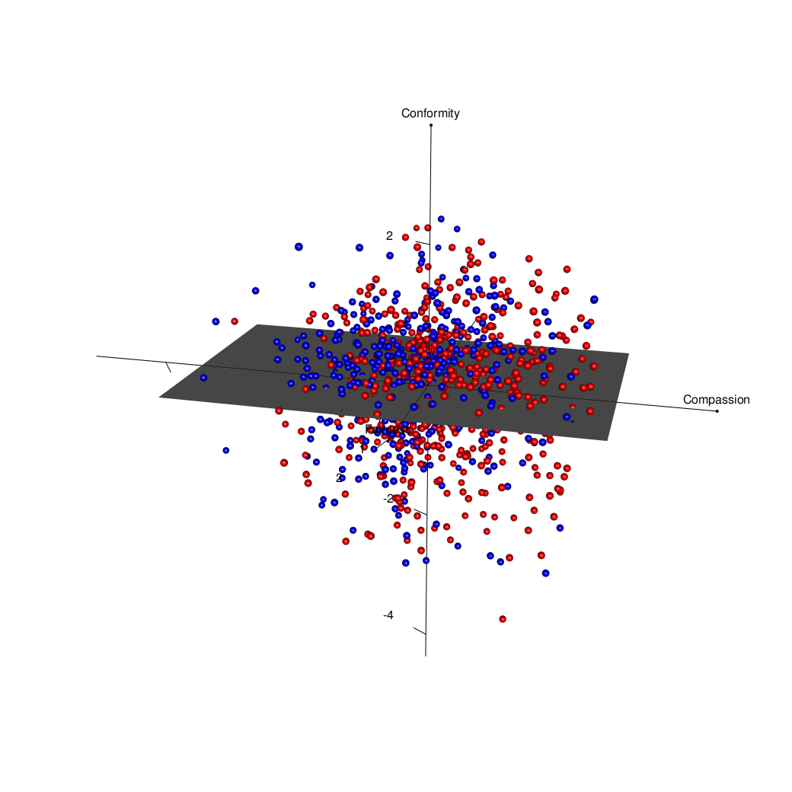
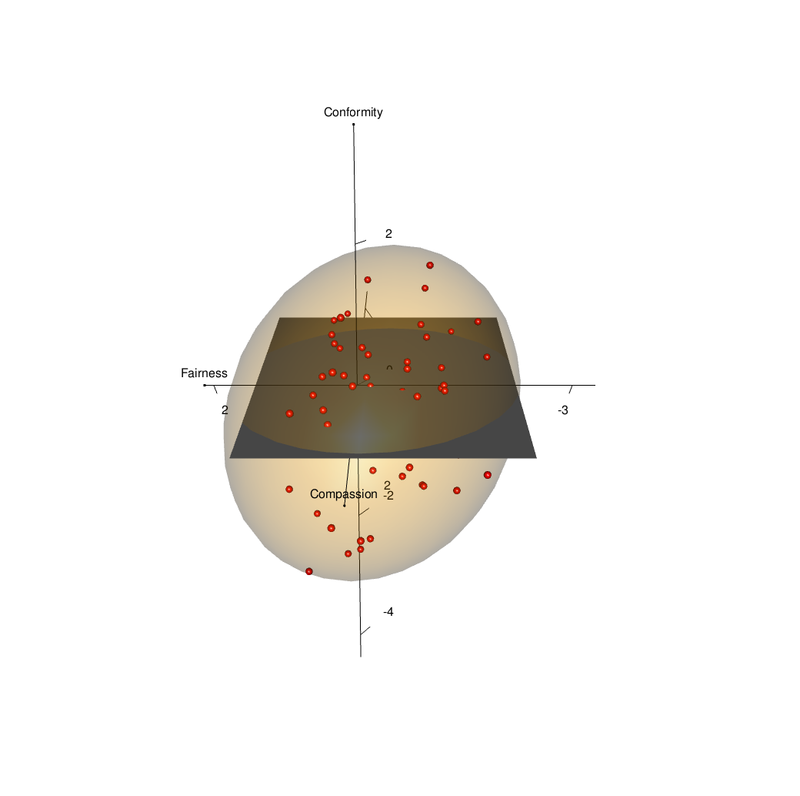

<div align="center">


</div>

# `D3MIRT` Modeling

The `D3mirt` analysis is based on descriptive multidimensional item
response theory (DMIRT; Reckase, 2009, 1985; Reckase & McKinley, 1991)
and can be used to analyze dichotomous and polytomous items (Muraki &
Carlson, 1995) in a three-dimensional ability ($\theta$) space. The
method is foremost visual and illustrates item characteristics with the
help of vector geometry in which items are represented by vector arrows.

In DMIRT analysis, also called within multidimensional modeling, it is
assumed that items in a multidimensional ability space can measure
single or multiple latent traits (Reckase, 2009, 1985; Reckase &
McKinley, 1991). The methodology is a type of data reduction technique
based on the compensatory model (Reckase, 2009), i.e., a type of
measurement model that uses linear combinations of $\theta$-values for
ability assessment. The method seeks to maximize item discrimination and
so is *descriptive* because the results describe the extent to which
items in a test are unidimensional, i.e., that the items discriminate on
one dimension only, or are within-multidimensional, i.e., that the items
discriminate on more than one dimension.

Regarding vector orientation, the angle of the vector arrows indicates
what traits, located along the orthogonal axes in the model, an item can
be said to describe (Reckase, 2009, 1985, Reckase & McKinley, 1991). For
instance, in a two-dimensional space, an item is *unidimensional* if its
item vector arrow is at $0°$ with respect to one of the axes in the
model, and $90°$ with respect to the other. Such an item describes a
singular trait only. In contrast, an item is *within-multidimensional*
if its item vector arrow is oriented at $45°$ in relation to the axes in
the model. Such an item describes both traits in the model equally well.
The same criteria are extended to the three-dimensional case.

The DMIRT approach uses two types of item models, dependent on item
type. If dichotomous items are used, the analysis is based on the
multidimensional two-parameter logistic model (M2PL). If polytomous
items are used, the analysis is based on the multidimensional
two-parameter graded response model (MGRM; Muraki & Carlson, 1995). The
method is therefore limited to items that fit these item models.

The estimation process begins by first fitting and extracting the
discrimination $a$ and difficulty parameters $d$ from a compensatory
model. Next, the DMIRT estimation uses the former to compute the
multidimensional discrimination ($MDISC$) parameter and the
multidimensional difficulty ($MDIFF$) parameter that is used to locate
the items in a vector space.

The $MDIFF$ is interpreted similarly as the difficulty parameter in the
unidimensional model, i.e., it shows the level of ability that is
required for a higher or correct response. Note, if polytomous items are
used, such as Likert items, the items will be represented by multiple
vector arrows (one for each response function). The $MDIFF$ will, in
such a case, show the multidimensional range of difficulty for an item
as located in a multidimensional latent trait space.

The $MDISC$ shows the highest level of discrimination an item can
achieve in the multidimensional model. It is, therefore, a global item
characteristic assuming a multidimensional latent space. In addition,
the $MDISC$ score is visualized in the graphical output by scaling the
length of the vector arrows representing the item response functions,
such that longer arrows indicate higher discrimination (and vice versa).

A novel theoretical contribution to DMIRT is the use of constructs in
the `D3mirt` functions. Constructs, in this context, refer to the
assumption that a subset of items can measure a higher-order latent
variable. In `D3mirt`, constructs are implemented as optional vectors
whose orientation is calculated as the average direction, i.e., the
average multidimensional discrimination of a subset of items (from one
item to all items in the set) in the model. A construct vector will,
therefore, point in the direction of the maximum slope of an imaginary
item response function indicated by the items chosen by the user.

If constructs are used, the output will include reporting of the
directional discrimination ($DDISC$) parameter that shows how well the
items discriminate under the assumption that they measure one of the
constructs used in the analysis. That is, while the $MDISC$ represents
the maximum level of discrimination in the model, the $DDISC$ represents
the local discrimination that makes it possible to compare item
discrimination in a specific direction set by the constructs. The
constructs are, therefore, like unidimensional models nested in the
multidimensional latent space and are visually represented with
construct vector arrows scaled to an arbitrary length.

# Overview

The package includes the following main functions.

- `modid()`: D3mirt Model Identification
- `D3mirt()`: 3D DMIRT Model Estimation
- `plot()`: Graphical Output for `D3mirt()`

## Installation

You can install the `D3mirt` package from CRAN, or try the development
version of the package, by using the following codes for `R`.

``` r
# Install from CRAN depository
install.packages('D3mirt')

# Install development version from Github
# install.packages("devtools")
# To include package vignette in the installation add: build_vignettes = TRUE
devtools::install_github("ForsbergPyschometrics/D3mirt")
```

In what follows, the `D3mirt` procedure, including the main functions
and some of the more essential arguments, will be described very briefly
using the built-in data set “anes0809offwaves”. The data set
($N = 1046, M_{age} = 51.33, SD = 14.56, 57\%$ Female) is a subset from
the American National Election Survey (ANES) from the 2008-2009 Panel
Study Off Wave Questionnaires, December 2009 (DeBell, et al, 2010;
<https://electionstudies.org/data-center/2008-2009-panel-study/>). All
items measure moral preferences and are positively scored of Likert
type, ranging from 1 = *Strongly Disagree* to 6 = *Strongly Agree*.
Demographic variables include age and gender (male/female).

The D3mirt approach largely consists of the following three steps:

1.  Model Identification
2.  D3mirt model estimation
3.  Plotting

For more details on the `D3mirt` package, including extended examples of
analysis and functions, please see the vignette included in the package
documentation.

# 1. Model Identification

As a first step in the analysis, the three-dimensional compensatory
model must be identified (Reckase, 2009). In the three-dimensional case,
this implies locating the $x$ and $y$-axis by selecting two items from
the item set. The first item should not load on the second and third
axes ($y$ and $z$), while the second item should not load on the third
axis ($z$). Consequently, if the model is not known beforehand it is
necessary to explore the data with exploratory factor analysis (EFA),
preferably with the help of the EFA methods suitable for DMIRT.

The `modid()` function was designed to help with this step in the
process. The function first performs an EFA using multidimensional item
response theory and then select items so that the strongest loading
item, from the strongest factor, always aligns perfectly with the
x-axis, and the remaining items follow thereafter. This helps makes the
result maximally interpretable while also avoiding imposing an
unempirical structure on the data.

Note, the EFA is only used to find model identification items that meet
the necessary DMIRT model specification requirements. The EFA model
itself is discarded after this step in the procedure. This implies that
the rotation method is less crucial and the user is encouraged to try
different rotation methods and compare the results.

Begin by loading the item data. Note, all outputs are available as
ready-made package files that can be loaded directly into the R session.

``` r
# Load data
data("anes0809offwaves")
x <- anes0809offwaves
x <- x[,3:22] # Remove columns for age and gender
```

The `modid()` can take in raw item data or a data frame with item factor
loadings. In the default mode (`efa = TRUE`), using raw data, the
function performs an EFA using the EFA option in the `mirt()` (Chalmers,
2012) function with three factors as default (`factors = 3`). The
function then finishes with the model identification. If, however, item
factor loadings are already available, the function can jump directly to
the model identification by setting `efa = FALSE`.

The output consists of an $S3$ object of class `modid` containing data
frames with model identification items, order of factor strength (based
on sum of squares), and item factor loadings. The function has two
arguments: the *lower* and *upper* bound. In brief, the lower bound
increase the item pool used in the procedure while the upper bound acts
as a filter that removes items that do not meet the necessary
statistical requirements. This implies that the upper bound should not,
in general, be manipulated.

``` r
# Optional: Load the EFA data for this example directly from the package file
load(system.file("extdata/efa.Rdata", package = "D3mirt"))

# Call to modid() with x, containing factors scores from the EFA
# Observe that the efa argument is set to false 
a <- modid(x, efa = FALSE)
summary(a)
#> 
#> modid: 20 items and 3 factors
#> 
#> Model identification items:
#> Item 1 W7Q3 
#> Item 2 W7Q20 
#> 
#>       Item.1    ABS
#> W7Q3  0.8547 0.0174
#> W7Q5  0.8199 0.0648
#> W7Q1  0.7589 0.0772
#> W7Q10 0.7239 0.0854
#> 
#>       Item.2    ABS
#> W7Q20 0.7723 0.0465
#> W7Q19 0.6436 0.0526
#> W7Q18 0.6777 0.0782
#> 
#>    SS Loadings
#> F2      5.3505
#> F1      2.1127
#> F3      1.6744
#> 
#>            F2      F1      F3
#> W7Q1   0.7589  0.0407 -0.0365
#> W7Q2   0.8901 -0.0263 -0.0838
#> W7Q3   0.8547 -0.0096 -0.0078
#> W7Q4   0.6628  0.0272  0.1053
#> W7Q5   0.8199 -0.0390 -0.0258
#> W7Q6   0.6654  0.0525  0.1054
#> W7Q7   0.5603 -0.0148  0.2087
#> W7Q8   0.5731  0.0390  0.1966
#> W7Q9   0.6151  0.0697  0.0918
#> W7Q10  0.7239  0.0371 -0.0483
#> W7Q11  0.2085  0.0959  0.5488
#> W7Q12  0.0755 -0.0853  0.5559
#> W7Q13 -0.0176 -0.0153  0.7654
#> W7Q14 -0.0407  0.1439  0.5629
#> W7Q15  0.1087  0.4556 -0.1111
#> W7Q16  0.1759  0.2100  0.1152
#> W7Q17  0.2160  0.5816  0.0261
#> W7Q18 -0.0560  0.6777 -0.0782
#> W7Q19  0.0589  0.6436  0.0526
#> W7Q20 -0.0735  0.7723  0.0465
```

The `summary()` function prints the number of items and the number of
factors used in the analysis together with the suggested model
identification items. As can be seen, the items suggested by `modid()`
are the items “W7Q3” and “W7Q20”. The output also includes data frames
that hold all the model identification items (`Item.1...Item.n`)
selected by `modid()` together with the items’ absolute sum score
(`ABS`), one frame for the sum of squares for factors sorted in
descending order, and one frame for item factor loadings.

The order of the factors follows the model identification items so that
item 1 comes from the strongest factor (sorted highest up), item 2 from
the second strongest (sorted second), and so on. The absolute sum scores
indicate statistical fit to the structural assumptions of the DMIRT
model and the items are, therefore, sorted with the lowest absolute sum
score highest up. The top items are the items that best meet the
necessary statistical requirements for the model identification. For a
three-dimensional model this implies that the item highest up in the
first data frame should be used to identify the $x$-axis, and the item
highest up in the second data frame should be used to identify the
$y$-axis, and so on. For more on the model identification procedure
(e.g., trouble shooting, criteria, or limitations), see function
documentation or package vignette.

# 2. D3mirt Model Estimation

The `D3mirt()` function takes model parameters from a three-dimensional
compensatory model (either in the form of a data frame or an S4 object
of class ‘SingleGroupClass’ exported from the `mirt()` (Chalmers, 2012)
function) and returns an $S3$ object of class `D3mirt` with lists of $a$
and $d$, $MDISC$, and $MDIFF$ parameters, direction cosines, and
spherical coordinates. Regarding the latter, spherical coordinates are
represented by $\theta$ and $\phi$. The $\theta$ coordinate is the
positive or negative angle in degrees, starting from the $x$-axis, of
the vector projections from the vector arrows in the $xz$-plane up to
$\pm 180°$. Note, the $\theta$ angle is oriented following the positive
pole of the $x$ and $z$ axis so that the angle increases clockwise in
the graphical output. The $\phi$ coordinate is the positive angle in
degrees from the $y$-axis and the vectors. Note, the $\rho$ coordinate
from the spherical coordinate system is in DMIRT represented by the
MDIFF, and so is reported separately.

If constructs are used, the function also returns construct direction
cosines, spherical coordinates for the construct vector arrows, and
$DDISC$ parameters (one index per construct).

The three-dimensional compensatory model is specified so that all items
load on all three factors in the model, and that the factors are
constrained to be orthogonal (see below). The fitting of the model is
preferably done with the `mirt()` (Chalmers, 2012) function. Please note
very carefully regarding the model specification in the example below.
However, because the fitting of the compensatory model in the `mirt()`
function takes a long time, the item parameters for this example are
contained in a data frame that is available in the package file
“mod1.Rdata”.

``` r
# Load data
data("anes0809offwaves")
x <- anes0809offwaves
x <- x[,3:22] # Remove columns for age and gender

# Fit a three-dimensional graded response model with orthogonal factors
# Example below uses Likert items from the built-in data set "anes0809offwaves"
# Item W7Q3 and item W7Q20 was selected with modid()
# The model specification set all items in the data set (1-20) 
# to load on all three factors (F1-F3)
# The START and FIXED commands are used on the two items to identify the DMIRT model
spec <-  ' F1 = 1-20
           F2 = 1-20
           F3 = 1-20

           START=(W7Q3,a2,0)
           START=(W7Q3,a3,0)

           START=(W7Q20,a3,0)

           FIXED=(W7Q3,a2)
           FIXED=(W7Q3,a3)

           FIXED=(W7Q20,a3) '

mod1 <- mirt::mirt(x, 
                   spec, 
                   itemtype = 'graded', 
                   SE = TRUE, 
                   method = 'QMCEM')
```

Constructs can be included in the analysis by creating one or more
nested lists that indicate what items belong to what construct. Such a
nested list can contain all items in the set down to a single item. From
this, the `D3mirt()` function finds the average direction of the subset
of items contained in each nested list by adding and normalizing the
direction cosines for the items and scaling the construct direction
vector to an arbitrary length (length can be adjusted by the user) so
that the arrows can be seen when plotting.

The construct vector arrows can contribute to the analysis by (a)
visualizing the average direction for a subset set of items, and (b)
showing how all items discriminate locally in the direction of the
construct vector with the help of the $DDISC$ index.

The `summary()` function is used to inspect the DMIRT estimates. The
constructs included below were grouped based on exploratory reasons,
i.e., because these items cluster in the model (observable in the
graphical output below).

``` r
# Optional: Load the mod1 data as data frame directly from the package file
load(system.file("extdata/mod1.Rdata", package = "D3mirt"))

# Call to D3mirt(), including optional nested lists for three constructs
# Item W7Q16 is not included in any construct because of model violations
# The model violations for the item can be seen when plotting the model
c <- list(list(1,2,3,4,5,6,7,8,9,10),
          list(11,12,13,14),
          list(15,17,18,19,20))
g <- D3mirt(mod1, c)
summary(g)
#> 
#> D3mirt: 20 items and 5 levels of difficulty
#> 
#> Constructs:
#> Vector 1: W7Q1, W7Q2, W7Q3, W7Q4, W7Q5, W7Q6, W7Q7, W7Q8, W7Q9, W7Q10
#> Vector 2: W7Q11, W7Q12, W7Q13, W7Q14
#> Vector 3: W7Q15, W7Q17, W7Q18, W7Q19, W7Q20
#> 
#>           a1      a2      a3      d1     d2     d3      d4      d5
#> W7Q1  2.0298  0.1643 -0.1233  8.0868 7.0642 5.9877  3.2015 -0.4836
#> W7Q2  2.6215 -0.0027 -0.2585  9.2889 6.6187 4.5102  1.6648 -2.4440
#> W7Q3  2.7917  0.0000  0.0000 10.4835 7.5865 5.6764  2.7167 -1.1788
#> W7Q4  1.9046  0.1874  0.1491  7.3754 6.0467 4.9814  2.4830 -1.1146
#> W7Q5  2.2423 -0.0287 -0.0841  8.4266 6.6706 4.9047  1.8252 -1.8316
#> W7Q6  2.0022  0.2390  0.1567  8.0687 6.3578 4.9520  2.3300 -1.0189
#> W7Q7  1.6286  0.1033  0.3593  6.0178 4.8974 3.6908  1.6326 -1.3484
#> W7Q8  1.7775  0.2252  0.3528  6.9171 5.1822 3.7661  1.4844 -1.8332
#> W7Q9  1.7199  0.2493  0.1278  7.5587 4.9755 3.3648  0.9343 -2.2094
#> W7Q10 1.7696  0.1272 -0.1407  8.3639 5.7396 4.2862  1.9646 -0.6642
#> W7Q11 1.4237  0.4673  1.0433  6.2180 4.6920 3.5430  1.1918 -1.8573
#> W7Q12 0.7605  0.0409  0.9366  4.1360 2.8770 2.3419  1.1790 -0.4239
#> W7Q13 1.1285  0.2910  1.6943  5.8922 4.4009 3.4430  1.8955 -0.6009
#> W7Q14 0.7448  0.4828  0.9785  5.3891 3.9333 3.0258  0.8144 -1.5868
#> W7Q15 0.4551  0.7870 -0.1606  4.3206 3.0544 2.3969  0.9187 -0.9705
#> W7Q16 0.6237  0.4139  0.1799  3.7249 2.0305 1.1658 -0.0612 -1.8085
#> W7Q17 1.1893  1.3412  0.0564  6.9011 5.8022 4.9344  2.7915 -0.0041
#> W7Q18 0.4107  1.3542 -0.1368  3.7837 2.0985 1.4183  0.1828 -1.9855
#> W7Q19 0.8580  1.4098  0.2279  4.4978 2.6483 1.6731  0.3740 -1.9966
#> W7Q20 0.7357  1.9068  0.0000  4.6378 2.3633 1.2791 -0.3431 -2.9190
#> 
#>        MDISC  MDIFF1  MDIFF2  MDIFF3  MDIFF4 MDIFF5
#> W7Q1  2.0402 -3.9638 -3.4625 -2.9348 -1.5692 0.2370
#> W7Q2  2.6343 -3.5262 -2.5125 -1.7121 -0.6320 0.9278
#> W7Q3  2.7917 -3.7553 -2.7176 -2.0333 -0.9731 0.4222
#> W7Q4  1.9196 -3.8421 -3.1500 -2.5950 -1.2935 0.5806
#> W7Q5  2.2441 -3.7550 -2.9725 -2.1856 -0.8133 0.8162
#> W7Q6  2.0225 -3.9894 -3.1435 -2.4485 -1.1520 0.5038
#> W7Q7  1.6710 -3.6013 -2.9308 -2.2087 -0.9770 0.8070
#> W7Q8  1.8261 -3.7880 -2.8379 -2.0624 -0.8129 1.0039
#> W7Q9  1.7425 -4.3377 -2.8553 -1.9310 -0.5362 1.2679
#> W7Q10 1.7797 -4.6995 -3.2249 -2.4083 -1.1039 0.3732
#> W7Q11 1.8259 -3.4055 -2.5697 -1.9404 -0.6527 1.0172
#> W7Q12 1.2071 -3.4263 -2.3834 -1.9400 -0.9767 0.3512
#> W7Q13 2.0564 -2.8653 -2.1401 -1.6743 -0.9218 0.2922
#> W7Q14 1.3211 -4.0794 -2.9773 -2.2904 -0.6164 1.2011
#> W7Q15 0.9232 -4.6800 -3.3085 -2.5963 -0.9951 1.0513
#> W7Q16 0.7699 -4.8381 -2.6373 -1.5142  0.0795 2.3490
#> W7Q17 1.7934 -3.8481 -3.2353 -2.7514 -1.5566 0.0023
#> W7Q18 1.4217 -2.6613 -1.4760 -0.9976 -0.1286 1.3966
#> W7Q19 1.6661 -2.6996 -1.5895 -1.0042 -0.2245 1.1984
#> W7Q20 2.0438 -2.2693 -1.1563 -0.6259  0.1679 1.4282
#> 
#>       D.Cos X D.Cos Y D.Cos Z    Theta     Phi
#> W7Q1   0.9949  0.0805 -0.0604  -3.4748 85.3808
#> W7Q2   0.9952 -0.0010 -0.0981  -5.6305 90.0597
#> W7Q3   1.0000  0.0000  0.0000   0.0000 90.0000
#> W7Q4   0.9922  0.0976  0.0777   4.4767 84.3967
#> W7Q5   0.9992 -0.0128 -0.0375  -2.1474 90.7326
#> W7Q6   0.9900  0.1182  0.0775   4.4765 83.2140
#> W7Q7   0.9746  0.0618  0.2150  12.4409 86.4543
#> W7Q8   0.9734  0.1233  0.1932  11.2272 82.9174
#> W7Q9   0.9870  0.1431  0.0734   4.2512 81.7735
#> W7Q10  0.9943  0.0715 -0.0791  -4.5468 85.9010
#> W7Q11  0.7797  0.2560  0.5714  36.2355 75.1698
#> W7Q12  0.6300  0.0339  0.7759  50.9236 88.0565
#> W7Q13  0.5488  0.1415  0.8239  56.3330 81.8637
#> W7Q14  0.5638  0.3655  0.7407  52.7234 68.5629
#> W7Q15  0.4929  0.8525 -0.1739 -19.4324 31.5149
#> W7Q16  0.8102  0.5376  0.2336  16.0853 57.4764
#> W7Q17  0.6631  0.7478  0.0315   2.7156 41.5968
#> W7Q18  0.2888  0.9525 -0.0962 -18.4194 17.7246
#> W7Q19  0.5150  0.8462  0.1368  14.8767 32.1990
#> W7Q20  0.3600  0.9330  0.0000   0.0000 21.0997
#> 
#>    C.Cos X C.Cos Y C.Cos Z   Theta     Phi
#> C1  0.9970  0.0687  0.0364  2.0923 86.0608
#> C2  0.6412  0.2026  0.7402 49.1006 78.3129
#> C3  0.4720  0.8814 -0.0207 -2.5136 28.1932
#> 
#>       DDISC1 DDISC2 DDISC3
#> W7Q1  2.0305 1.2435 1.1054
#> W7Q2  2.6040 1.4890 1.2403
#> W7Q3  2.7832 1.7899 1.3177
#> W7Q4  1.9171 1.3695 1.0611
#> W7Q5  2.2305 1.3696 1.0348
#> W7Q6  2.0183 1.4482 1.1524
#> W7Q7  1.6439 1.3311 0.8523
#> W7Q8  1.8004 1.4464 1.0301
#> W7Q9  1.7364 1.2478 1.0289
#> W7Q10 1.7679 1.0562 0.9503
#> W7Q11 1.4895 1.7797 1.0622
#> W7Q12 0.7951 1.1891 0.3756
#> W7Q13 1.2068 2.0366 0.7541
#> W7Q14 0.8113 1.2996 0.7568
#> W7Q15 0.5019 0.3324 0.9118
#> W7Q16 0.6568 0.6169 0.6555
#> W7Q17 1.2799 1.0759 1.7422
#> W7Q18 0.4975 0.4364 1.3902
#> W7Q19 0.9606 1.0044 1.6428
#> W7Q20 0.8645 0.8580 2.0278
```

The `D3mirt()` function prints a short report containing the number of
items used and the levels of difficulty of the items when the estimation
is done. As can be seen, when construct vectors are used, the function
also prints the number of construct vectors and the names of the items
included in each construct. Next, the factor loadings and the difficulty
parameters from the compensatory model are reported in data frames
followed by all necessary DMIRT estimates.

# 3. Plotting

The `plot()` method for objects of class `D3mirt` is built on the `rgl`
package (Adler & Murdoch, 2023) for visualization with OpenGL. Graphing
in default mode by calling `plot()` will return an RGL device that will
appear in an external window as a three-dimensional interactive object,
containing vector arrows with the latent dimensions running along the
orthogonal axes, that can be rotated. In this illustration, however, all
RGL devices are plotted inline as still shots displayed from two angles,
$15^{\circ}$ (clockwise; default plot angle) and $90^{\circ}$. To change
the plot output to $90^{\circ}$, use the `view` argument in the `plot()`
function and change the first indicator from $15$ to $90$.

``` r
# Plot RGL device with constructs visible and named
plot(g, constructs = TRUE, 
        construct.lab = c("Compassion", "Fairness", "Conformity"))
```


Figure 1: Three-dimensional vector plot for all items and the three
constructs Compassion, Fairness, and Conformity (solid black arrows)
plotted with the model rotated $15^{\circ}$ clockwise.



Figure 2: Three-dimensional vector plot for all items and the three
constructs Compassion, Fairness, and Conformity (solid black arrows)
plotted with the model rotated $90^{\circ}$ clockwise.

An example of how the output can be described could be as follows.

> As can be seen in Figures 1 and 2, the pattern in the data indicates
> the presence of foremost two main nested latent constructs indicated
> by the items, one aligned with the $x$-axis and one approaching the
> $y$-axis. We might also suspect the presence of a third construct
> located close to the $xy$-plane, between the $x$ and $z$ axes.
> Studying the content of the items, the labels *Compassion*,
> *Fairness*, and *Conformity* were introduced. The angles of the
> constructs inform us that Compassion ($\theta = 2.092^{\circ}$,
> $\phi = 86.061^{\circ}$) and Conformity ($\theta = -2.514 ^{\circ}$,
> $\phi = 28.193^{\circ}$) have some within-multidimensional tendencies.
> However, they are both more or less orthogonal to the $z$-axis. Next,
> we find Fairness ($\theta = 49.101^{\circ}$, $\phi = 78.313^{\circ}$)
> with clear within-multidimensional tendencies with respect to the
> $x$-axis. Thus, the output indicates that Compassion and Conformity
> could be independent constructs but that Fairness seems not to be.

## 3.1. `items`

A subset of items can be plotted for a more thorough investigation using
the `items` argument. In the example below, all constructs are plotted
together with the items used for the conformity construct. In the
function call, the numerical indicators in the `items` argument follow
the item order in the original data frame (see `?anes0809offwaves`).

``` r
# The Conformity items from the model plotted with construct vector arrows
plot(g, constructs = TRUE, 
        items = c(15,17,18,19,20), 
        construct.lab = c("Compassion", "Fairness", "Conformity"), 
        view = c(15, 20, 0.6))
```


Figure 7: The items from the Conformity construct plotted with the model
rotated $15^{\circ}$ clockwise.


Figure 8: The items from the Conformity construct plotted the model
rotated $90^{\circ}$ clockwise.

The `plot()` function also allows plotting a single item by entering a
single number indicating what item that should be displayed. As was
mentioned above, the W7Q16 was not included in any of the constructs
because the item showed signs of measurement problems. For example, the
short vector arrows indicate high amounts of model violations and the
location of the item in the model also indicates that the item is
within-multidimensional and that it does not seem to belong to any
construct explicitly. Typing in $16$ in the `items` argument allows for
a closer look.

``` r
# Item W7Q16 has location 16 in the data set (gender and age excluded)
# The item is plotted together with construct to aid the visual interpretation
plot(g, constructs = TRUE, 
        items = 16, 
        construct.lab = c("Compassion", "Fairness", "Conformity"))
```


Figure 3: The item W7Q16 plotted with the three constructs and with the
model rotated $15^{\circ}$ clockwise.


Figure 4: The item W7Q16 plotted with the three constructs and with the
model rotated $90^{\circ}$ clockwise.

An example of how the output for analysis of the single item could be as
follows.

> The Figures 3 and 4 shows that item W7Q16 is located at
> $\theta = 16.085^{\circ}$, $\phi = 57.476^{\circ}$, indicating that
> the item is within-multidimensional with respect to the $x$ and
> $y$-axis; but much less so with respect to the $z$-axis. In addition,
> the directional discrimination further underscores that the item does
> not seem to measure any particular construct ($DDISC_1 = .657$,
> $DDISC_2 = .617$, $DDISC_3 = .656$). The global discrimination
> ($MDISC = .770$, $MDIFF_{range} = [-4.838, 2.349]$) is also the lowest
> of all discrimination scores in the model. This, combined, implies
> that the item in question does not seem to fit the three-dimensional
> DMIRT model used in this analysis and should therefore be removed or
> adapted. On a side note, we can also note that item W7Q15,
> $MDISC = .923$, $MDIFF_{range} = [-4.680, 1.051]$) has the second
> lowest global discrimination score. However, this item does seem to
> belong to the Conformity construct, observable when comparing angle
> orientation ($\theta = -19.432^{\circ}, \phi = 31.515^{\circ}$) and
> direction discrimination ($DDISC_1 = .502$, $DDISC_2 = .332$,
> $DDISC_3 = .912$).

## 3.2. `diff.level`

The user has the option of plotting on one level of difficulty at a time
with the `diff.level` argument studying the entire scale, a subset of
items, or on one item at a time. Note, *difficulty* refers to the number
of item response functions in the items, i.e., the total number of
response options minus one. In this case, $6$ response options were used
which means that the model has $5$ levels of difficulty.

``` r
# Plot RGL device on item difficulty level 5
plot(g, diff.level = 5, 
        view = c(15, 20, 0.6))
```



Figure 5: All items plotted on difficulty level 5 and with the model
rotated $15^{\circ}$ clockwise.



Figure 6: All items plotted on difficulty level 5 and with the model
rotated $90^{\circ}$ clockwise.

## 3.3 `scale`

The `D3mirt()` function returns item vector coordinates estimated with
and without the $MDISC$ as a scalar for the arrow length. When the
$MDISC$ is not used for the arrow length, all item vector arrows are
scaled to one unit length. This allows the user to graph the item vector
arrows with `plot()` set to a uniform length. This can help reduce
visual clutter in the graphical output. To view the item vector arrows
without the $MDISC$, set `scale = TRUE`.

``` r
# Plot RGL device with items in uniform length and constructs visible and named
plot(g, scale = TRUE, 
        constructs = TRUE, 
        construct.lab = c("Compassion", "Fairness", "Conformity"), 
        view = c(15, 20, 0.6))
```



Figure 9: All items scaled to uniform length and plotted with the model
rotated $15^{\circ}$ clockwise.


Figure 10: All items scaled to uniform length and plotted with the model
rotated $90^{\circ}$ clockwise.

## 3.4. `D3mirt` Profile Analysis

The `plot()` function can also display respondents in the
three-dimensional model represented as spheres located using respondent
factors scores used as coordinates. This allows for a profile analysis
in which respondents can be separated, or subset, conditioned on single
or multiple criteria and then plotted. The resulting output shows where
the respondents are located in the model, and, accordingly, what model
profile best describes them. Similarly, respondent categories can be
simultaneously compared to see if a group-level effect can be visually
observed.

To do this, the user must first extract respondent factor scores with
`fscores()` (Chalmers, 2012) and then separate or select a subset of
respondent rows based on one or more criteria. The resulting data frame
is imputed in the `profiles` argument. Generally, it can be useful to
hide vector arrows with `hide = TRUE` when plotting respondent profiles
to avoid visual cluttering. The example below separates respondents
using the gender variable included in the built-in data set.

``` r
# Extract respondent factor scores from mod1 with fscores()
f <- mirt::fscores(mod1, 
                   method="EAP", 
                   full.scores = TRUE, 
                   full.scores.SE = FALSE, QMC = TRUE)
```

``` r
# Optional: Load the respondent factor scores for this example directly from the package file
load(system.file("extdata/fscores.Rdata", package = "D3mirt"))

# Attach f to the gender variable (column 2 from anes0809offwaves data set; "W3XGENDER")
# Use cbind with fscores() output attached first
data("anes0809offwaves")
x <- anes0809offwaves
z <- data.frame(cbind(f, x[,2]))
```

The `plot()` function uses `as.factor()` to count the number of factor
levels in the data imputed in the `levels` argument. This means that raw
data can be used as is but the number of colors in the color vectors
argument (`sphere.col`) may need to be adapted. In the example below,
the criteria variable for gender only hold two factor levels and
therefore only two colors in the color vector are needed.

Call `plot()` with the respondent data frame $z$ in the `profiles`
argument and the `levels` argument with the levels column subset from
$z$. In the function call below, the axes in the model are named using
the `x.lab`, `y.lab`, and `z.lab` arguments following the direction of
the constructs. Note, the model axes represent unidimensional singular
structures, or traits, in this case borrowing the names of the
constructs.

``` r
# Plot profiles with item vector arrows hidden with hide = TRUE
# Score levels: 1 = Blue ("male") and 2 = Red ("female")
plot(g, hide = TRUE, 
     profiles = z, 
     levels = z[,4], 
     sphere.col = c("blue", "red"), 
     x.lab = "Compassion", 
     y.lab="Conformity", 
     z.lab="Fairness")
```



Figure 11: Gender profile for the `anes0809offwaves` data set plotted
with the model rotated $15^{\circ}$ clockwise.


Figure 12: Gender profile for the `anes0809offwaves` data set plotted
with the model rotated $90^{\circ}$ clockwise.

An example of how the output can be described could be as follows.

> In Figures 5 and 6, it can be observed a simple profile on gender in
> which more women tend to have higher levels of Compassion. When
> rotating the model $90^{\circ}$ clockwise, there seems not to be any
> easily observable gender difference related to Conformity or Fairness.

## 3.5. Plotting Confidence Intervals

It is also possible to plot a confidence interval in the shape of an
ellipse surrounding the individual factor scores. In the example below,
the younger individuals ($\leq30$) are selected and plotted together
with a $95\%$ *CI*.

``` r
# Column bind fscores() with age variable ("W3Xage") from column 1
y <- data.frame(cbind(f, x[,1]))

# Subset data frame y conditioned on age <= 30
z1 <- subset(y, y[,4] <= 30)
```

When a criterion variable has a wide data range, such as an age
variable, `rep()` can be used to set the appropriate size of the color
vector for `sphere.col` by repeating color names with `rep()`. When
plotting, the `plot()` function will pick colors from the `sphere.col`
argument following the factor order in the levels argument. To do this,
the first step is to count the number of factors in the criterion
variable. This can be done with `nlevels()`, as can be seen below.

``` r
# Check number of factor levels with nlevels() and as.factor()
nlevels(as.factor(z1[,4]))
#> [1] 14

# Use rep() to create a color vector to color groups based on the nlevels() output
# z1 has 14 factor levels
colvec <- c(rep("red", 14))
```

To plot the *CI*, the `ci` argument is set to `TRUE`. The color of the
sphere was also changed from default `grey80` to `orange` in the example
below. Note, the *CI* limit can be adjusted with the `ci.level`
argument.

``` r
# Call plot() with profile data on age with item vector arrows hidden
plot(g, hide = TRUE, 
     profiles = z1, 
     levels = z1[,4], 
     sphere.col = colvec, 
     x.lab = "Compassion", 
     y.lab="Conformity", 
     z.lab="Fairness", 
     ci = TRUE, 
     ci.level = 0.95, 
     ellipse.col = "orange")
```


Figure 13: Adults less than or equal to age 30 from the
`anes0809offwaves` data set plotted surrounded by a $95\%\,CI$ and with
the model rotated $15^{\circ}$ clockwise.



Figure 14: Adults less than or equal to age 30 from the
`anes0809offwaves` data set plotted surrounded by a $95\%\,CI$ and with
the model rotated $90^{\circ}$ clockwise.

An example of how the output can be described could be as follows.

> In Figures 7 and 8 we can see a tendency for a profile on age in which
> younger individuals could be described as less oriented towards
> Conformity. We can also observe a tendency for what could be an
> interaction effect in which higher levels of Conformity seem to be
> associated with lower levels of Fairness.

# 4. Exporting The RGL Device

Some options for exporting the RGL device are shown below. Over and
above these, it is also possible to export graphical devices in R
Markdown documents with `rgl::hookwebgl()` together with graphical
options for knitr, as was done when creating this vignette.

``` r
# Export an open RGL device to the console that can be saved as an html or image file
plot(g, constructs = TRUE)
s <- scene3d()
rgl::rglwidget(s, 
               width = 1040, 
               height = 1040)

# Export a snap shoot of an open RGL device directly to file
plot(g, constructs = TRUE)
rgl::rgl.snapshot('RGLdevice.png', 
                    fmt = 'png')
```

# Getting Help and Reporting Bugs

If you encounter a bug, please file an issue with a minimal reproducible
example on GitHub (<https://github.com/ForsbergPyschometrics/D3mirt>).
For questions please contact me on Github or via email
(<forsbergpsychometrics@gmail.com>).

# References

Adler, D., & Murdoch, D. (2023). *Rgl: 3d Visualization Using OpenGL*
\[Computer software\]. <https://dmurdoch.github.io/rgl/index.html>

Chalmers, R., P. (2012). mirt: A Multidimensional Item Response Theory
Package for the R Environment. *Journal of Statistical Software, 48*(6),
1-29. <https://doi.org/10.18637/jss.v048.i06>

DeBell, M., Krosnick, J. A., & Lupia, A.(2010). *Methodology Report and
User’s Guide for the 2008-2009 ANES Panel Study*. Palo Alto, CA, and Ann
Arbor, MI: Stanford University and the University of Michigan.

Muraki, E., & Carlson, J. E. (1995). Full-Information Factor Analysis
for Polytomous Item Responses. *Applied Psychological Measurement,
19*(1), 73-90. <https://doi.org/10.1177/014662169501900109>

Reckase, M. D.(2009).*Multidimensional Item Response Theory*. Springer.
<https://doi.org/10.1007/978-0-387-89976-3>

Reckase, M. D.(1985). The Difficulty of Test Items That Measure More
Than One Ability. *Applied Psychological Measurement, 9*(4),401-412.
<https://doi.org/10.1177/014662168500900409>

Reckase, M. D., & McKinley, R. L. (1991). The Discriminating Power of
Items That Measure More Than One Dimension. *Applied Psychological
Measurement, 15*(4), 361-373.
<https://doi.org/10.1177/014662169101500407>
